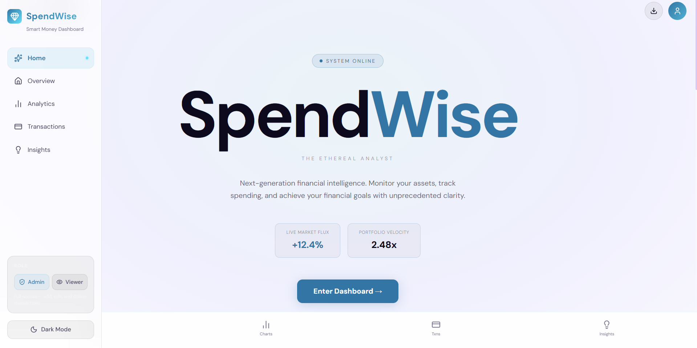
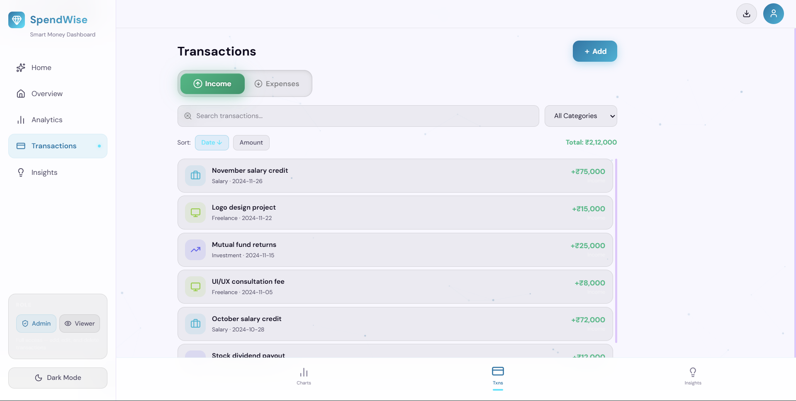
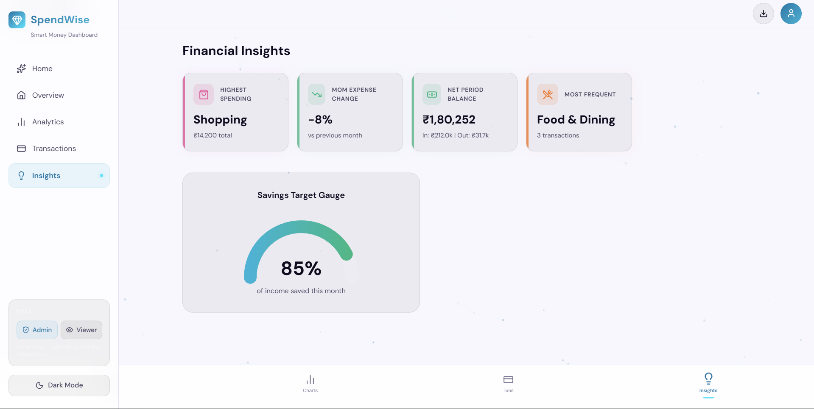
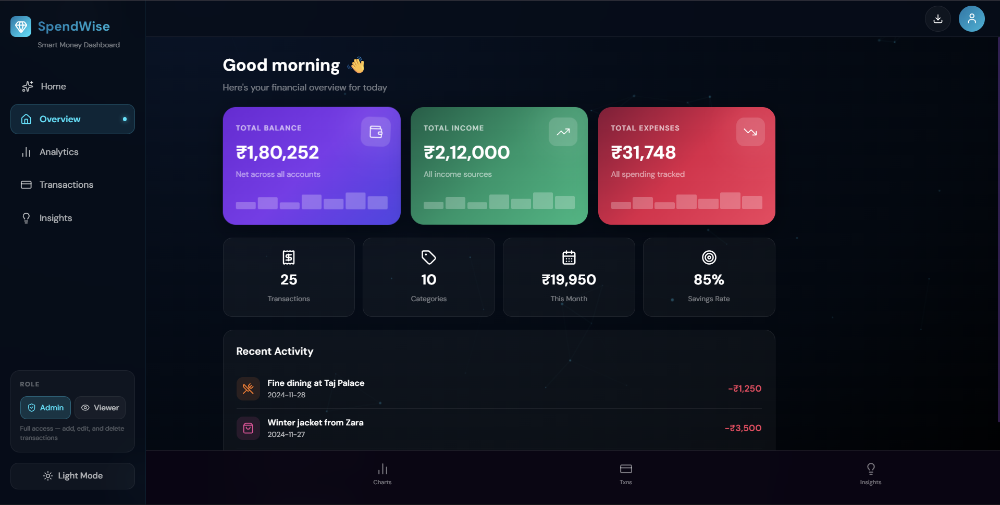

# 💰 SpendWise - Smart Money Dashboard

> A modern, intuitive finance dashboard UI for tracking expenses, analyzing spending patterns, and making smarter financial decisions.

[](https://reactjs.org/)
[](https://vitejs.dev/)
[](https://tailwindcss.com/)
[](LICENSE)


*Screenshot coming soon*

---

## 📋 Problem Statement

Managing personal finances can be overwhelming without the right tools. Users need:
- **Clear visibility** into their financial status at a glance
- **Detailed transaction tracking** with easy filtering and search
- **Actionable insights** to understand spending patterns
- **Role-based access** for different user permissions (Admin/Viewer)

SpendWise addresses these challenges with an elegant, user-friendly dashboard that transforms raw financial data into meaningful insights.

---

## 🎯 Features

### 📊 Dashboard Overview
- **Financial Summary Cards**: Total balance, income, and expenses at a glance
- **Visual Charts**: Interactive spending breakdowns and trend analysis
- **Quick Stats**: Transaction counts, category distribution, savings rate
- **Responsive Design**: Seamless experience across desktop, tablet, and mobile

### 💳 Transaction Management
- **Comprehensive List**: All transactions with detailed information
- **Advanced Filtering**: Filter by date, category, type (income/expense)
- **Smart Search**: Quickly find specific transactions
- **Sorting Options**: Sort by date, amount, or category
- **Add/Edit/Delete**: Full CRUD operations (Admin role only)

### 🔐 Role-Based Access Control
- **Admin Mode**: Full access to add, edit, and delete transactions
- **Viewer Mode**: Read-only access to view data and insights
- **Easy Toggle**: Switch between roles seamlessly

### 📈 Insights & Analytics
- **Spending Patterns**: Identify where your money goes
- **Category Breakdown**: Visual representation of spending by category
- **Monthly Comparisons**: Track changes over time
- **Financial Health Metrics**: Savings rate, debt ratio, and more

### 🎨 Additional Features
- **Dark/Light Mode**: Choose your preferred theme
- **Smooth Animations**: Powered by Framer Motion for delightful interactions
- **Data Export**: Download transactions as CSV
- **Persistent State**: Your preferences and data stay saved locally

---

## 🛠️ Tech Stack

**Frontend Framework**
- ⚛️ React 18.3.1 - Component-based UI library
- ⚡ Vite - Lightning-fast build tool and dev server

**Styling & UI**
- 🎨 Tailwind CSS 3.4 - Utility-first CSS framework
- 💫 Framer Motion - Smooth animations and transitions
- 🎭 Lucide React - Beautiful icon library

**State Management**
- 🐻 Zustand - Lightweight state management
- 💾 localStorage - Persistent client-side storage

**Data Visualization**
- 📊 Recharts - Composable charting library

**Development Tools**
- 📝 ESLint - Code quality and consistency
- 🔧 Vite - Modern build tooling

---

## 🏗️ Architecture & Approach

### Component-Based Design
The application follows a modular component architecture:
- **Pages**: Main views (Overview, Transactions, Charts, Insights)
- **Components**: Reusable UI components (Sidebar, Cards, Modals)
- **Layout**: Consistent app structure with navigation

### State Management
- **Zustand Store**: Centralized state for transactions, user role, theme preferences
- **Local Storage**: Automatic persistence of user data and preferences
- **Reactive Updates**: UI updates automatically when state changes

### Data Handling
- **Mock Data**: Pre-populated sample transactions for demonstration
- **Local State**: All operations happen client-side
- **Data Structure**: Organized transaction objects with categories, dates, and amounts

---

## 📁 Folder Structure

```
Zorvyn/
├── src/
│   ├── components/          # Reusable UI components
│   │   ├── Home.jsx        # Landing page
│   │   ├── Overview.jsx    # Dashboard overview
│   │   ├── Charts.jsx      # Analytics charts
│   │   ├── Transactions.jsx # Transaction list
│   │   ├── Insights.jsx    # Spending insights
│   │   ├── Sidebar.jsx     # Navigation sidebar
│   │   └── ParticleBackground.jsx
│   ├── store/              # State management
│   │   └── useStore.js     # Zustand store
│   ├── data/               # Mock data
│   │   └── mockTransactions.js
│   ├── App.jsx             # Main app component
│   ├── main.jsx            # Entry point
│   └── index.css           # Global styles
├── public/                 # Static assets
├── .gitignore             # Git ignore rules
├── package.json           # Dependencies
├── vite.config.js         # Vite configuration
└── README.md              # Documentation
```

---

## 🚀 Setup Instructions

### Prerequisites
- Node.js (v16 or higher)
- npm or yarn

### Installation

1. **Clone the repository**
   ```bash
   git clone https://github.com/ADITYA-J1/Spend-Wise.git
   cd Spend-Wise
   ```

2. **Install dependencies**
   ```bash
   npm install
   ```

3. **Start the development server**
   ```bash
   npm run dev
   ```

4. **Open in browser**
   ```
   Navigate to http://localhost:5173
   ```

### Build for Production

```bash
npm run build
```

The optimized production build will be in the `dist/` folder.

### Preview Production Build

```bash
npm run preview
```

---

## 📸 Screenshots

### Dashboard Overview

*Financial summary with charts and quick stats*

### Transactions

*Complete transaction list with filtering and search*

### Insights

*Spending patterns and analytics*

### Dark Mode

*Sleek dark theme support*

---

## 🎮 Usage

1. **Explore Dashboard**: View your financial overview on the main dashboard
2. **Browse Transactions**: Navigate to Transactions to see all your financial activities
3. **Analyze Spending**: Check Insights for detailed spending patterns
4. **Switch Roles**: Toggle between Admin/Viewer to see different permissions
5. **Add Transactions** (Admin): Click "Add Transaction" to create new entries
6. **Export Data**: Download your transactions as CSV for external use
7. **Toggle Theme**: Switch between dark and light modes

---

## 🔮 Future Enhancements

- 🔄 **Real-time Sync**: Connect to backend API for real-time data
- 📱 **Mobile App**: React Native version for iOS/Android
- 🤖 **AI Insights**: Machine learning-based spending predictions
- 📊 **Advanced Reports**: Downloadable PDF reports and analytics
- 🔔 **Notifications**: Budget alerts and spending reminders
- 🌐 **Multi-currency**: Support for international transactions
- 👥 **User Authentication**: Secure login and user profiles
- 💾 **Cloud Storage**: Sync data across devices
- 📅 **Budget Planning**: Set and track monthly budgets
- 🎯 **Financial Goals**: Track progress toward savings goals

---

## 🤝 Contributing

Contributions are welcome! Feel free to:
- 🐛 Report bugs
- 💡 Suggest new features
- 🔧 Submit pull requests

---

## 📄 License

This project is licensed under the MIT License - see the [LICENSE](LICENSE) file for details.

---

## 👨‍💻 Author

**Aditya Jain**
- GitHub: [@ADITYA-J1](https://github.com/ADITYA-J1)
- Project: [SpendWise Dashboard](https://github.com/ADITYA-J1/Spend-Wise)

---

## 🌟 Acknowledgments

- Design inspiration from modern fintech apps
- Icons by [Lucide](https://lucide.dev/)
- Charts powered by [Recharts](https://recharts.org/)
- Built with ❤️ using React and Vite

---

## 📞 Support

If you find this project helpful, please ⭐ star the repository!

For questions or feedback, feel free to open an issue.

---

<div align="center">
  <sub>Built with passion for better financial management 💰</sub>
</div>
